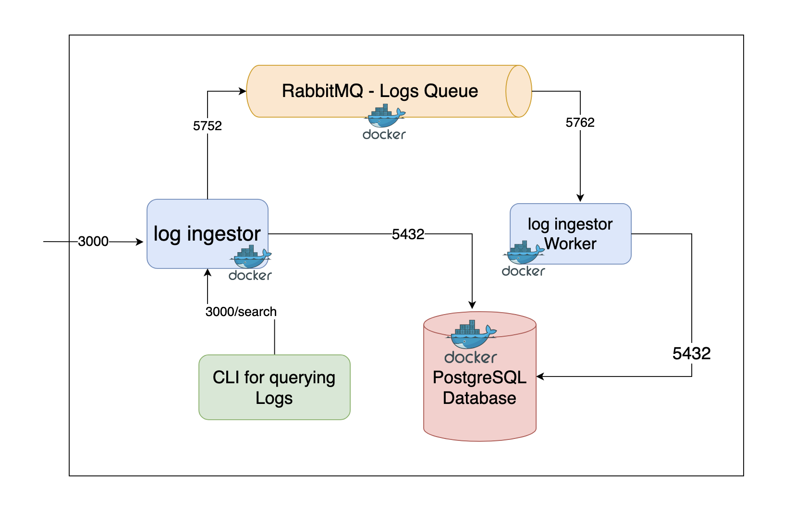

[](https://classroom.github.com/a/2sZOX9xt)
# Log Ingestor and Query Interface


## Description

This project consists of a Log Ingestor and a Query Interface designed to efficiently handle vast volumes of log data with a simple CLI for querying using full-text search or specific field filters.


## Log Ingestor

The Log Ingestor is a system designed in Golang. It is responsible for handling and processing logs. The process is as follows:

- When logs are populated to port 3000, the system sends these logs to a queue in RabbitMQ.
- A worker process then dequeues the logs from RabbitMQ, processes them, and stores them in the database.
- The database indexing is done to facilitate efficient querying and retrieval of logs.

#### Technology Used

- Golang: The primary language used to build the Log Ingestor.
- RabbitMQ: Used for queuing the logs for asynchronous processing.
- PostgreSQL: The database where processed logs are stored. Indexing is done in the database to optimize log retrieval.


#### Installation and Usage

`git clone https://github.com/shubham-yadavv/log-ingestor.git`
`cd log-ingestor`

### docker compose

`docker-compose up -d
`

You can access the server at: ```http://localhost:3000```

environment variables
```
DB_HOST = localhost
DB_USER = shubham
DB_PASSWORD = jarvis
DB_NAME = logsdb
DB_SSL_MODE = disable
AMQP_URL = amqp://rabbitmq:5672
```
## Query Interface 

The Query Interface is a Command Line Interface (CLI) designed to apply filters to the logs for easy retrieval. It has the following features:

- Implemented search within specific date ranges.
- Allows combining multiple filters.
- Implemented role-based access to the query interface.

### Technology Used

- Python: The primary language used to build the Query Interface.
- Click: A Python package for creating beautiful command line interfaces in a composable way.


### Installing
`git clone https://github.com/shubham-yadavv/log-ingestor.git`

`cd query interface`

**Install the necessary package from requirements.txt**
`pip install -r requrements.txt
`

### Usage

1. Login
`python query_cli.py login`

2. Enter Username and Password (admin has the access)

username: admin
password : admin

3. search logs accoring to the filters as following:
```
You are logged in as admin
1. Search logs
2. Logout
Choose an option (1 or 2):
```

4. Search accorging to the filters
```
Search logs:
Enter log level (optional) []: error
Enter log message (optional) []:
Enter resource ID (optional) []:
Enter timestamp (optional) []:
Enter trace ID (optional) []:
Enter span ID (optional) []:
Enter commit (optional) []:
Enter parent resource ID (optional) []:
Enter start date (optional, format: YYYY-MM-DD) []:
Enter end date (optional, format: YYYY-MM-DD) []:
```

## System Design




## Scope For Improvement

1. The CLI for querying logs currently uses HTTP calls for database operations. A more efficient method could be implemented to improve performance.

2. A NoSQL database could be used for better filtration of logs. This would allow for more flexible and efficient querying.